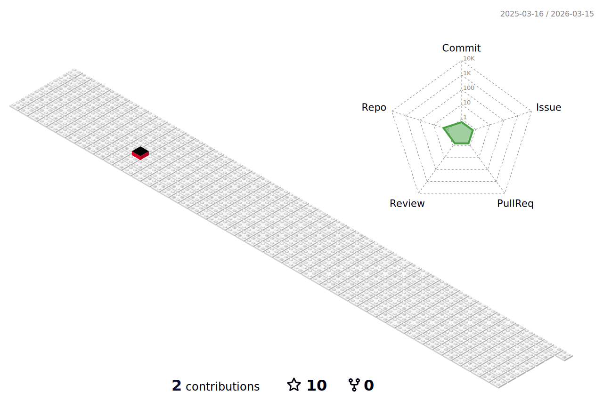

<b> - 🔭 I’m currently working on: Full Stack Development | React | Node.js | React Native | Redux | Material UI | REST APIs | JavaScript | </b>

<b> - 🌱 I'm eager to teach what I know and enthusiastic about learning new things.

<b> - 👀 Currently learning everything with a smile on my face! 😄 </b>

<b> - 💞️ Slowly but steadily, I'm striving to become better than yesterday. 😉 </b>

<b> - 👯 I’m open to collaborate on more open source projects. </b>

<!--
- 📚 Proficient in HTML, CSS, JavaScript, Python, Java, C, and Figma.
- 🌐 Visit my [Portfolio](https://github.com/RanitManik/Portfolio-1.0) to explore my projects and achievements.
- 📝 Writing technical blogs on [Hashnode](https://hashnode.com/@ranitmanik).
- 📧 Reach me via [Email](mailto:ranitmanik.dev@gmail.com) or connect on [LinkedIn](https://www.linkedin.com/in/ranit-manik/).
- 📍 Currently based in Mecheda, West Bengal, India.
-->

<!--
## 🌐 Socials:

-->
 

<!--

-->

<h2 align="center">📊 𝗚𝗶𝘁𝗛𝘂𝗯 𝗦𝘁𝗮𝘁𝘀 📊</h2>
 

<table >
<tr style="border:none;">
<td>

</td>
<td>

</td>
</tr>
</table>

### GitHub stats card

  

  

  
  
  
   

 

<h2 align="center">🏆 𝗚𝗶𝘁𝗛𝘂𝗯 𝗧𝗿𝗼𝗽𝗵𝗶𝗲𝘀 🏆</h2>
 

  <picture>
    <source media="(prefers-color-scheme: dark)" srcset="https://github-profile-trophy.vercel.app/?username=AliAksoyy&theme=radical&no-frame=false&no-bg=false&margin-w=4&row=1" />
    <source media="(prefers-color-scheme: light)" srcset="https://github-profile-trophy.vercel.app/?username=AliAksoyy&no-frame=false&no-bg=false&margin-w=4&row=1" />
    
  </picture>

 
 
<h2 align="center">💻 𝗧𝗲𝗰𝗵 𝗦𝘁𝗮𝗰𝗸 💻</h2>
 
 

  
  

 
    
  
  
  
 
   
 
 

 
 
<h2 align="center" > 🧑‍🏫 My Projects 🧑‍🏫</h2>

###

| Project Demo                                                                                                                                           | Libraries and Technologies I use                                                                                                                                         | Project Preview                                                                                         |
| :----------------------------------------------------------------------------------------------------------------------------------------------------- | ------------------------------------------------------------------------------------------------------------------------------------------------------------------------ | ------------------------------------------------------------------------------------------------------- |
| [Github User App React](https://github-useres-react.vercel.app/) <h3>[Repo](https://github.com/AliAksoyy/Github-Useres-React)</h3>                     | I used mainly REACT and Styled Components, React Router, React Icons, Context API, Axios, React/Auth0, React/FusionCharts, React/Toastify, Props , Hooks, Authentication |   |
| [Stock App React](https://stock-app-react-weld.vercel.app/) <h3>[Repo](https://github.com/AliAksoyy/stock-app-react)</h3>                              | ReactJS, Material UI, React Toastify, React/Tremor, REACT / Components , Props , Hooks , Custom Hooks Router, Redux, Redux/Toolkit Formik-Yup, Authentication            |       |
| [React Blog App](https://react-blog-app-rho.vercel.app/) <h3>[Repo](https://github.com/AliAksoyy/React-BlogApp)</h3>                                   | ReactJS, Material UI, React Toastify, Bootstrap, REACT / Components , Props , Hooks , Router, Redux, Formik-Yup, Firebase Realtime Database, Firebase Authentication     |         |
| [React Fire-Contact App](https://react-fire-contact-app.vercel.app/) <h3>[Repo](https://github.com/AliAksoyy/React-FireContactApp)</h3>                | ReactJS, Material UI, React Toastify, REACT / Components , Props , Hooks Firebase Firestore DB                                                                           |      |
| [React Movie App](https://react-movie-app-ruby.vercel.app/) <h3>[Repo](https://github.com/AliAksoyy/react-MovieApp)</h3>                               | ReactJS, Material UI, Firebase Authentication, React Toastify, Fetch API - Axios, Context API                                                                            |          |
| [React Turkey Weather Router App](https://react-turkey-weather-app.vercel.app/) <h3>[Repo](https://github.com/AliAksoyy/React-Turkey-Weather-App)</h3> | ReactJS, Styled Components, Bootstrap, React Icons, Axios and Async Await, LocalStroage                                                                                  |           |
| [React Recipe App](https://react-recipe-app-nine.vercel.app/) <h3>[Repo](https://github.com/AliAksoyy/React-Recipe-App)</h3>                           | ReactJS, Styled Components, Router, Fetch Api, LocalStorage                                                                                                              |    |
| [React Router App](https://react-router-app-three.vercel.app/) <h3>[Repo](https://github.com/AliAksoyy/React-Router-App)</h3>                          | ReactJS, React Router, External CSS                                                                                                                                      |  |
