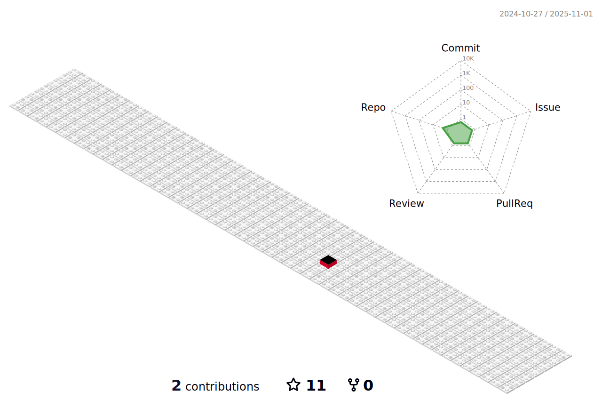

# AliAksoyy /README.md
### <h2 align="center">Hi 👋! My name is Ali Aksoy and I'm a Front-end Developer with React skills</h2> 

 - :telescope: I’m currently working on JavaScript | React | Redux | Material UI | Rest API's | Bootstrap | SASS | HTML | CSS | Scrum | Jquery | Git

- 🌱  I am happy to teach you what I knowand eager to learn what you will offer

- 👀  I’m currently learning everything  😄

- 💞️  Slowly and steadily, I'm trying to be better than yesterday😉  

- 👯 I’m looking to collaborate on more open source projects.

<!--
## 🌐 Socials:

 
 
-->
 

 

<h2 align="center"> My projects</h2>

###

  Project Demo       |Libraries and Technologies I use     |Project Preview   
:-------------------------|-------------------------|-------------------------
[React Schiphol Airport Flights App](https://reliable-chimera-0baadb.netlify.app/) <h3>[Repo](https://github.com/canocalir/schipol-metrics)</h3> | ReactJS, Styled Components, React Toastify, Official Schipol Api |
[React - Redux Firebase Blog App](https://gleaming-bunny-a87b8c.netlify.app/) <h3>[Repo](https://github.com/canocalir/reactor-blog)</h3> | ReactJS, Styled Components, Redux Toolkit, Firebase | 
[React Rijks Museum Color to Art App](https://startling-paprenjak-68c1ff.netlify.app/) <h3>[Repo](https://github.com/canocalir/rijksmuseum-colortopainting)</h3> | ReactJS, Styled Components, React Router, Sass, Official RijksMuseum Api |
[React Firebase Movie App](https://musical-moonbeam-a4cdde.netlify.app/) <h3>[Repo](https://github.com/canocalir/movie-database)</h3> | ReactJS, Styled Components, Firebase Authentication, Flowbite React, Tailwind CSS, The Movie Database Api, React Toastify |
[React Turkey Earthquake App](https://chimerical-eclair-cd9cee.netlify.app/) <h3>[Repo](https://github.com/canocalir/earthquake-app)</h3> | ReactJS, Pigeon Maps, SASS Modules |
[React Recipe App](https://prismatic-duckanoo-10bdd4.netlify.app/login) <h3>[Repo](https://github.com/canocalir/recipe-app)</h3> | ReactJS, React Router, Styled Components, SASS Modules |
[React Pokemon App](https://dulcet-chimera-3865aa.netlify.app/) <h3>[Repo](https://github.com/canocalir/pokemon-test)</h3> | ReactJS, React Router, SASS |
[React Dashboard Example App(Task)](https://immfly-frontend-test.herokuapp.com/) <h3>[Repo](https://github.com/canocalir/immflyfrontend)</h3> | ReactJS, CSS |
[React Developer News App](https://canocalir.github.io/popular-news/) <h3>[Repo](https://github.com/canocalir/popular-news)</h3> | ReactJS, CSS |
[React Ingredient Recognition App](https://carty-food-recognition.herokuapp.com/) <h3>[Repo](https://github.com/canocalir/carty-frontend)</h3> | ReactJS, CSS |
[React Pricing Table App](https://rainbow-creponne-a8121c.netlify.app/) <h3>[Repo](https://github.com/canocalir/react-pricing-table)</h3> | ReactJS, CSS |
[React Random User App](https://resilient-brioche-95a033.netlify.app/) <h3>[Repo](https://github.com/canocalir/random-user-app)</h3> | ReactJS, SASS Module |
[React Employee List App](https://sensational-quokka-924ea3.netlify.app/) <h3>[Repo](https://github.com/canocalir/employee-list)</h3> | ReactJS, SASS Module |

 

# 💻 Tech Stack:

 

  
  

 
    
  
  
  
 
   
 
 
<!--
   

  

  

  
  
  
   

  

  

-->
